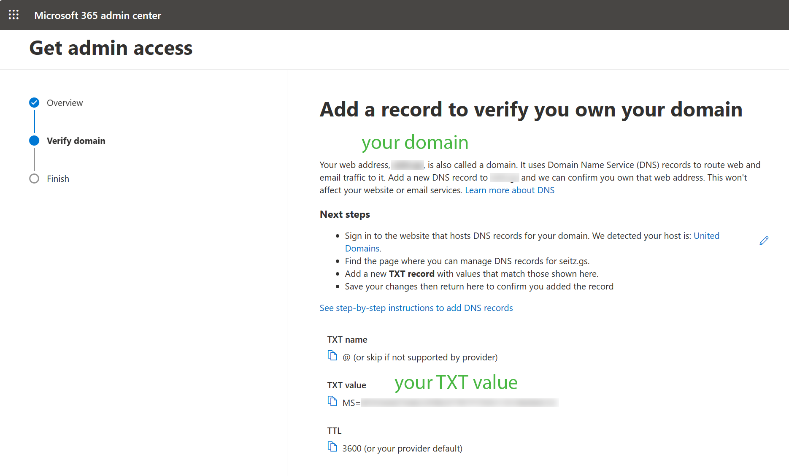
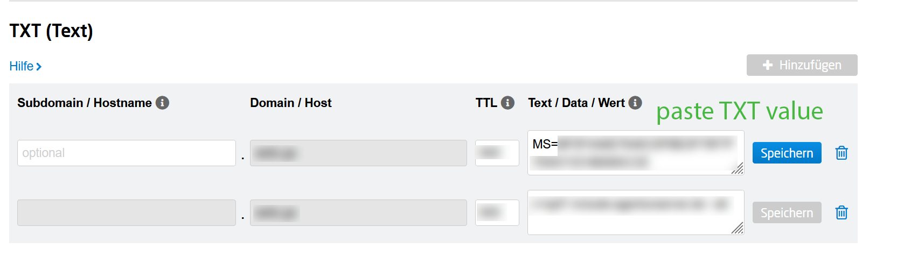
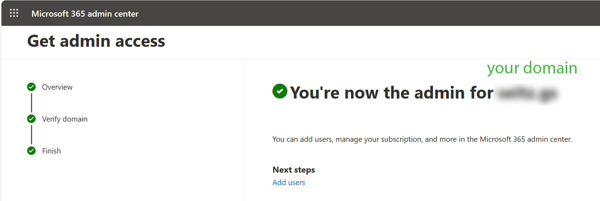

# Internal Admin Takeover

:::{note}
**Take Over an Unmanaged Directory**
Internal admin takeover in Azure AD is a process that allows anyone with an email address in the organization's directory and access to that email, to become a Global Administrator in Azure Active Directory.
:::

## MS doc
Microsoft provides a detailed [step-by-step guide to 'take over an unmanaged directory'](https://learn.microsoft.com/en-us/entra/identity/users/domains-admin-takeover).

## Basic Steps

Here are just basic steps from the MS step-by-step guide. 

### 1. PBi Service

Login to your PowerBI Service with your domain.

 

### 2. MS 365

Login to your 365 MS Account and click 'Admin'. There you could copy 'TXT value', e.g. MS=SOMESTRINGSANDNUMBERS.

 

### 3. DNS host

Login in to the website that hosts DNS records for your domain. Microsoft probably detects that for you, so you could follow the link and add (paste) 'TXT value' to your DNS records. 

:::{hint}
:class: margin
That's the reason why we wrote this documentation, we want to keep track of configurations in and outside of Azure.
:::

 

### 4. MS 365

Confirm account, MS will check your DNS entry, that could take moment.

