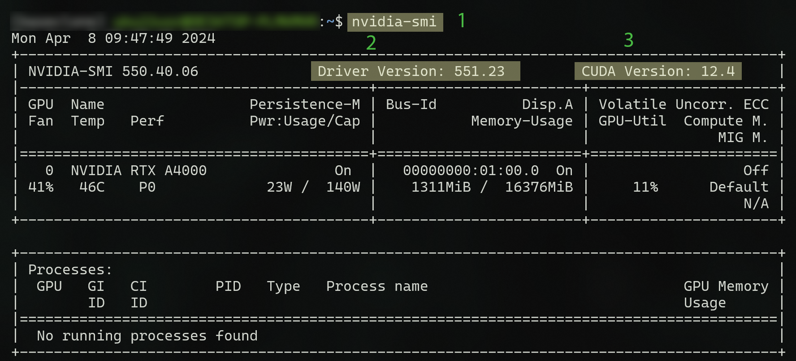
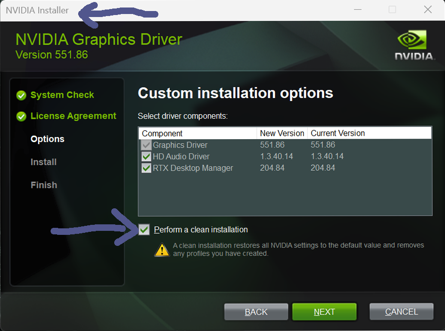
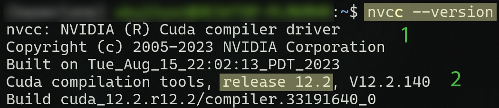

# NVIDIA @ Windows

This documentation is specifically crafted to aid users in navigating the intricacies of utilizing TensorFlow. It provides insight into crucial details concerning NVIDIA and CUDA drivers and their integration with TensorFlow, aiming to enhance understanding in this aspect.

NVIDIA & CUDA Driver
---



| No |             |                |
|----|------------------|--------------------------|
| 1  | cmd              | `nvidia-smi`             |
| 2  | installed        | NIVIA driver version     |
| 3  | highest possible | CUDA version             |

:::{danger}
CUDA Version: This is **not** the installed CUDA version, this is the highest possible version compatible with the current NVIDIA driver.
:::

<br>

NVIDIA Installer
---



:::{tip}
NVIDIA installer has the option for `clean installation`. This could be useful, if you make changes in the driver configuration. 

```{code-block}
:caption: Windows Command Prompt as admin

    > cd \Windows\System32\lxss\lib
    > del libcuda.so
    > del libcuda.so.1
    > mklink libcuda.so libcuda.so.1.1
    > mklink libcuda.so.1 libcuda.so.1.1

```

:::

<br>

CUDA Driver
---



| No |             |                  |
|----|------------------|------------------|
| 1  | cmd              | `nvcc --version` |
| 2  | installed        | CUDA version     |

:::{important}
CUDA Version: ´nvcc --version´ returns the installed CUDA version **on your system**, that doesn't mean ``Tensorflow`` will use it in your `python environment`. `pip install tensorflow[and-cuda]` will install it's on CUDA and CUDnn drivers. If you check the drivers in Python, you have to separte between system and environment installations.  
:::

<br>
